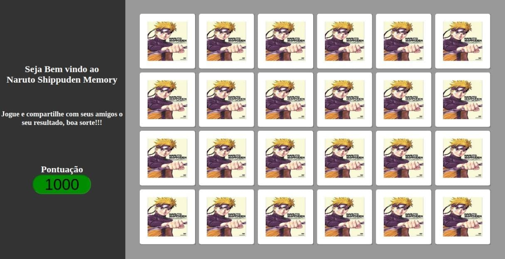

<h1>
  
</h1>

# Indice

- [Sobre](#-sobre)
- [Tecnologias](#-tecnologias-utilizadas)
- [Download](#-como-fazer-download-do-projeto)

## 📋 Sobre

O projeto consiste em um jogo de memória idealizado para colocar em prática o conteúdo apresentado até o momento do **Programa Starter 3ª Edição** da [Growdev](https://growdev.com.br/)

---

## 🚀 Tecnologias utilizadas

O projeto foi desenvolvido utilizando as seguintes tecnologias.

- [Html](https://html.com/)
- [CSS](https://www.w3.org/Style/CSS/Overview.en.html)
- [JavaScript](https://www.javascript.com/)

---

## ⬇️ Como fazer download do projeto

```bash
  # Clonar o repositório
  $ git clone http://github.com/Ferreira94/NarutoShippudenMemory
  # Entrar no diretório
  $ cd NarutoShippudenMemory
```

Após clonar o repositório e entrar no diretório do projeto é necessário abrir o arquivo **index.html**.

---
Desenvolvido por Luciano Ferreira.